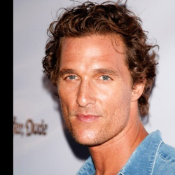

# Introduction
This is a web application developed with python and [Flask](https://flask.palletsprojects.com/en/2.2.x/).
It is an interface to allow a user to create images by uploading a face image and applying various filters.

# Installation

- clone this repository.
- install python 3.7.
- install requirements from requirements.txt using the following command.
  - pip install -r requirements.txt.
- download [deeplabv3_xception_tf_dim_ordering_tf_kernels.h5](https://github.com/ayoolaolafenwa/PixelLib/releases/download/1.1/deeplabv3_xception_tf_dim_ordering_tf_kernels.h5) the model used for background change.

# How to use

You can start the flask app by running the following command in your terminal

    flask --app main run --port=8080

Now open your browser at [http://127.0.0.1:8080](http://127.0.0.1:8080) and you will be able to see the following view

You have to choose a square image containing a face that is going to be transformed(input image).
After selecting the image to be transformed you can choose from four features to be applied to your image.
- Background option is the background to be used at the final picture. If you do not want the background to change just select the *none* option. 
- Change age makes the face in the image to look like an older self.
- Anime transforms the image to look like an animation from Japan.
- Sketch shows the outline of the face and the background.

After uploading the image you are sent to another view where your produced image can be seen. All the produced images (for each feature step) can be found in /static/images folder.

# Description

## Age GAN model
For the age transformation we used [Fast-AgingGAN](https://github.com/HasnainRaz/Fast-AgingGAN) model.
This is a face aging deep learning model based on the CycleGAN, where they translate young faces to old.

**Example**

## Change background model

This feature is based on *pixellib* package. Using the following lines of code it understands the background of *sample.jpg* and changes it with the given *background.jpg*.  
    
    from pixellib.tune_bg import alter_bg
    alter_bg().change_bg_img(
      f_image_path = "sample.jpg",
      b_image_path = "background.jpg",
      output_image_name="new_img.jpg"
    )

[Tutorial](https://towardsdatascience.com/change-the-background-of-any-image-with-5-lines-of-code-23a0ef10ce9a) contains more details.

- Available backgrounds

- Add more backgrounds
You can add more background by adding an image file in the static/backgrounds folder. If the image name is *background_name.jpeg* then you would be able to select it in the background drop down list with the name *background_name*

**Example**

## Anime GAN model

For the anime transformation we used [AnimeGan2](https://github.com/bryandlee/animegan2-pytorch) model.
This model given a face image produces an anime image of the face.

**Example**

## Sketch

Following the steps from this [tutorial](https://www.geeksforgeeks.org/convert-image-into-sketch/), we get the outlines of the images that can be used if someone wants to sketch a portrait.  

**Example**

## Combination
The features can also be combined. When more than one feature is chosen the server produces more than image.

**Example**

# Future work
- show the background images in the dropdown list of the upload view.
- use an age model that can also produce a face younger than the original or take the desired age as a parameter.
- use an anime model that takes a parameter to control how strong the transformation should be.